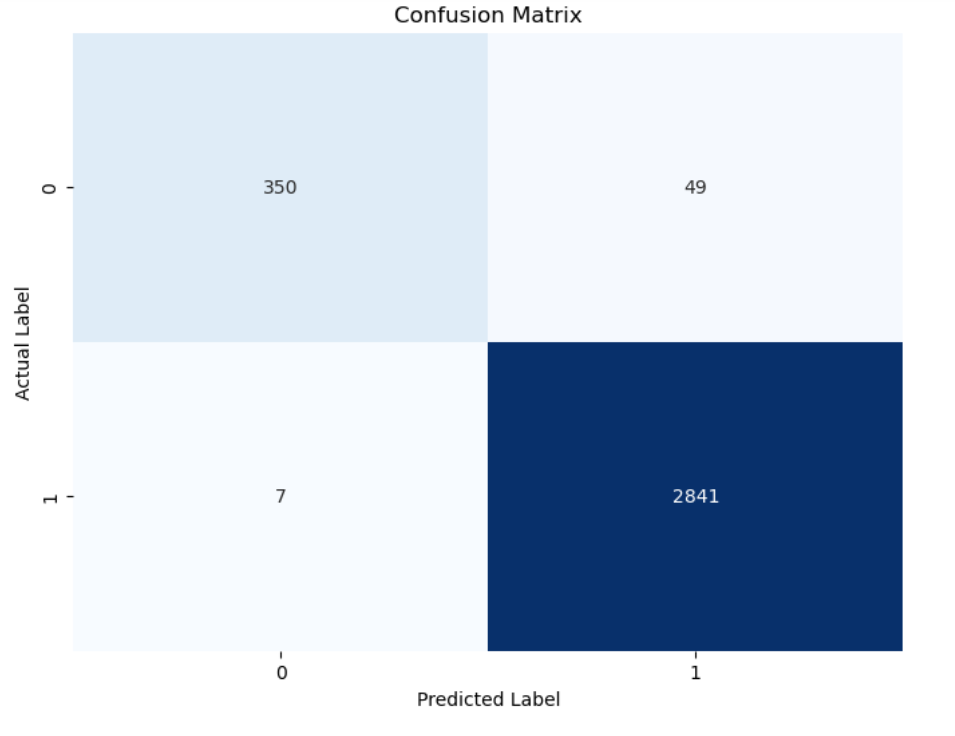
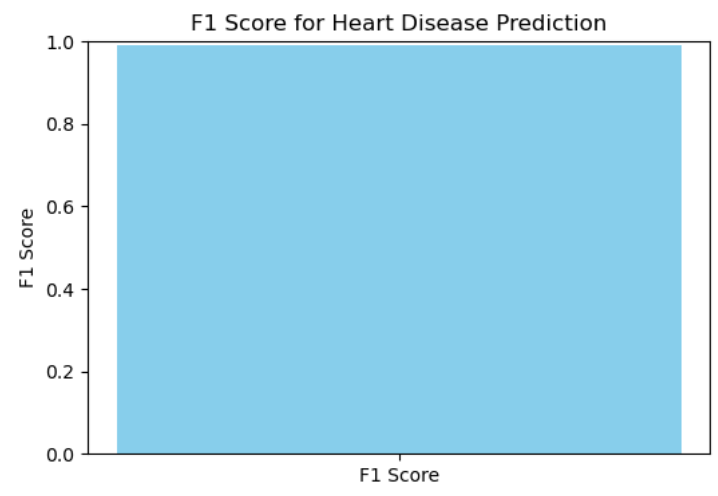

# Heart Disease Prediction Using ECG Signals

This project uses ECG signal data and a Random Forest classifier to predict heart disease. The Random Forest model is trained using features derived from ECG signals processed through the `heartpy` library. The project also implements a pipeline for cross-validation, hyperparameter tuning, and model evaluation using metrics like F1 score and confusion matrix.

## Table of Contents

- [Introduction](#introduction)
- [Features](#features)
- [Usage](#usage)
- [Model Training](#model-training)
- [Prediction](#prediction)
- [Results](#results)

## Introduction

The goal of this project is to develop a machine learning model that can accurately predict heart disease from ECG signal data. The dataset includes ECG readings from patients, and a Random Forest model is used for classification. The system processes ECG signals to extract meaningful features and uses these features to classify whether or not a patient has heart disease.

## Features

- **ECG Signal Processing**: Extracts features from ECG signals using the `heartpy` library.
- **Random Forest Classifier**: A Random Forest model is trained on the processed features.
- **Cross-Validation**: Cross-validation is implemented for model evaluation.
- **Hyperparameter Tuning**: Uses `RandomizedSearchCV` to find the best hyperparameters for the Random Forest model.
- **Model Evaluation**: Outputs the F1 score and confusion matrix to evaluate model performance.

## Results

### Confusion Matrix

The confusion matrix below shows the model's performance on the test data:

### Feature Importance

The plot below shows the F1_score:

